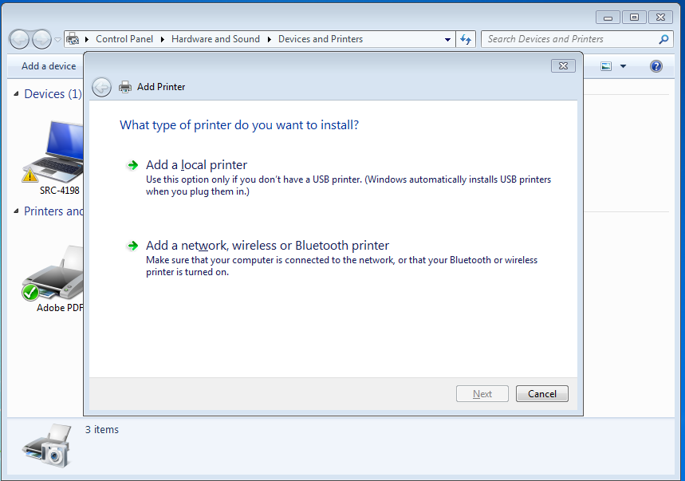
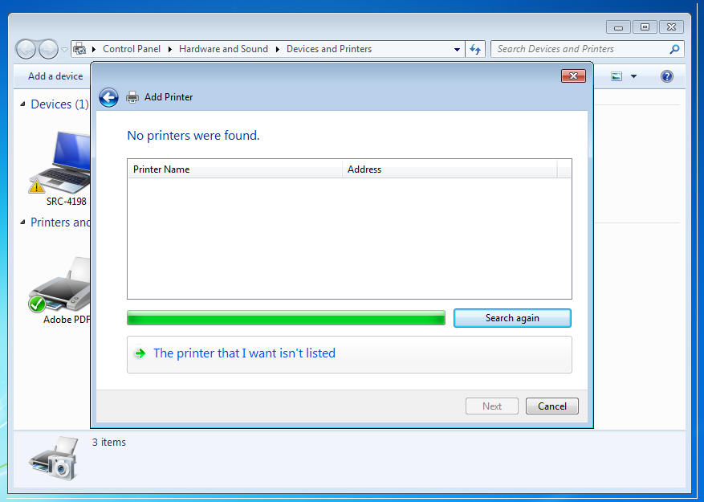
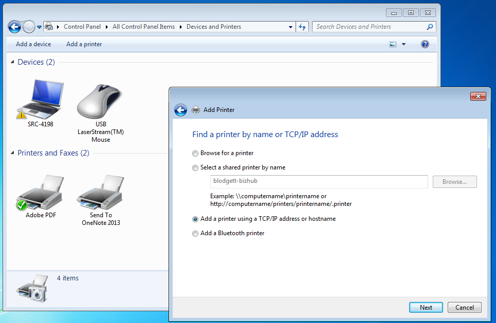
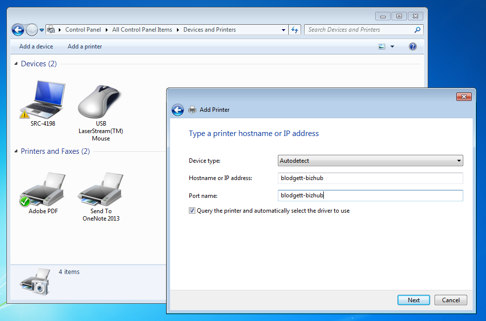
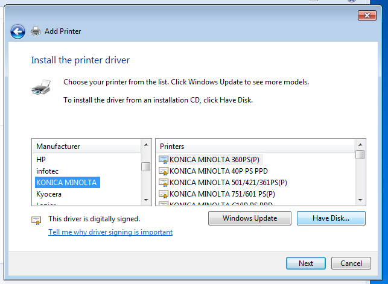

## General Instructions

To add a network printer:

1. Go to 'Control Panel'

1. Click into 'Hardware and Sound', and then into 'Printers'

1. Select 'Add Printer', and choose the option for 'Add a network, wireless or Bluetooth printer'

1. The Wizard will search for available printers (which takes a minute).  For SRC staff, the printers to which we're connecting won't be listed, so click 'Stop' to end the search, and then click 'The printer that I want isn't listed'.

1. The Add Printer Wizard will then ask how you wish to find the printer.  Select 'Add a printer using a TCP/IP address or hostname', then click 'Next'

1. Where the Wizard prompts you to add a printer hostname or IP address, enter in the name of the specific printer to which you'd like to connect. [**note:** The names of most campus printers are specified on a label affixed to the top of the device.]  Leave checked the box asking if you wish to query the printer and to select a driver, then click 'Next'.

1. When prompted, select the printer make and models and install the appropriate drivers. [**Note:** Most printers on campus will be correctly identified by the Wizard during this step. If not, you will either need to select your printer from a list of options provided by the Wizard, or otherwise choose 'Have Disk' and install the correct drivers (see below).]

...

Assuming that all went well, then you're all set. Congrats, and happy printing!

...

## Instructions for Unrecognized Printers

1. If your printer isn't immediately recognized by the Wizard, you will be presented with a list of options. Try to locate the make and model that you are using.

1. In some cases (especially for our Konica Minolta BizHubs), you may not be able to find the correct model listed among the Wizard options. In this case, you'll need to first download. 

 

For the Konica Minolta in Blodget, for example, search the Konica Minolta website for 'bizhub 423' and then download the 'PLC' driver files:

1. Once you have the drivers downloaded, extract their container .ZIP file:

 

Then return to the Add Printer Wizard, tell it that you have the drivers on disk, navigate to them and then select them

After clicking 'OK', your printer should appear as having a digitally-signed driver. If so, click 'Next'.

...

Assuming you were able to work through these steps, your printer should be set up correctly.  If not, contact ITS for help.

