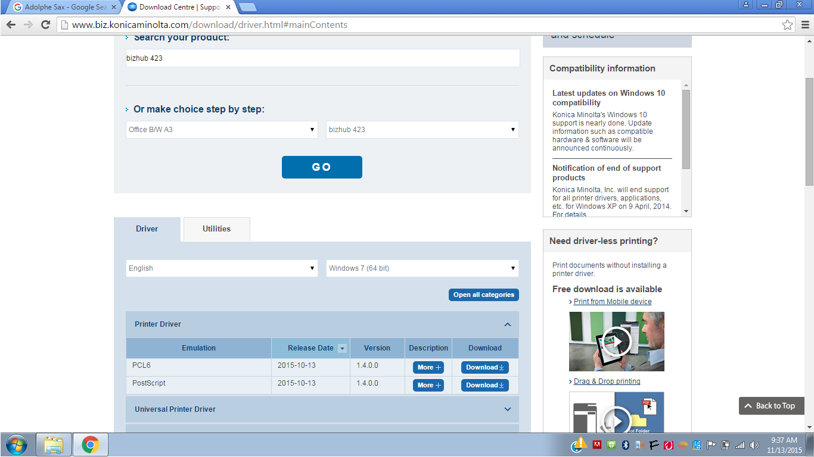
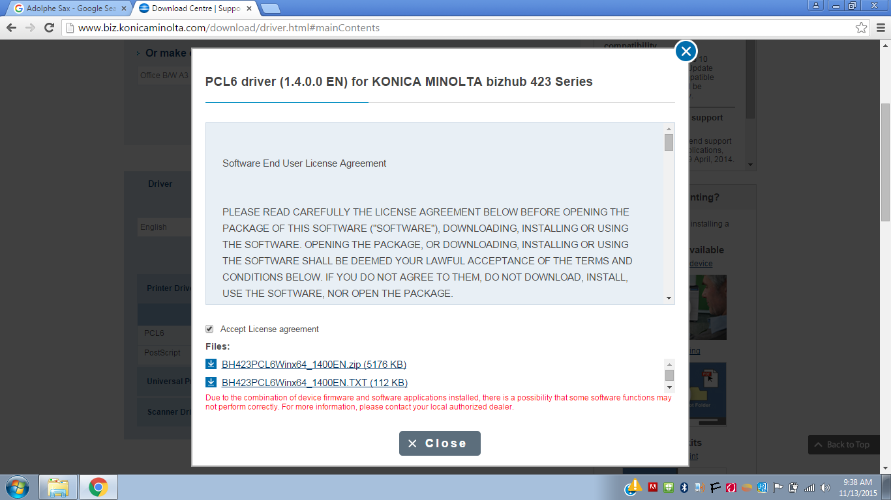
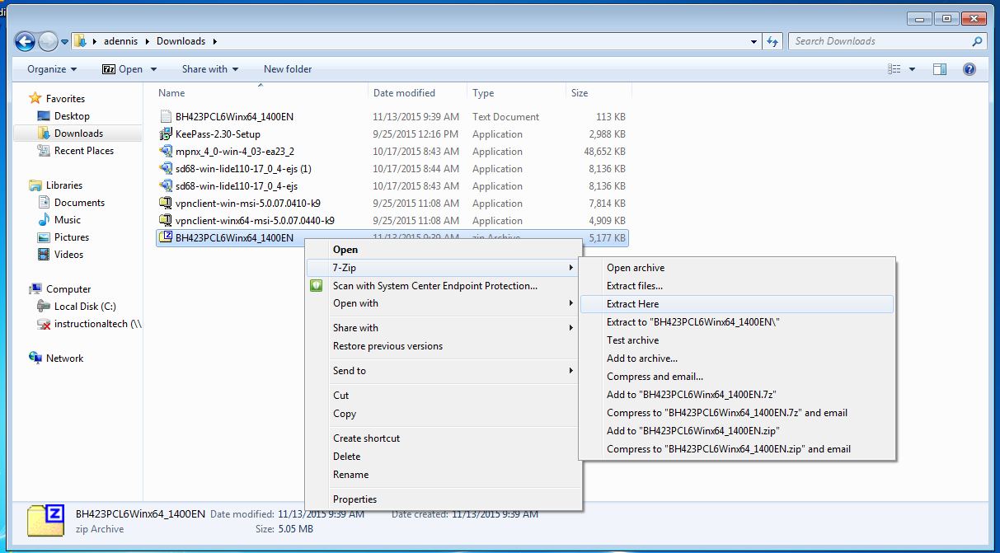
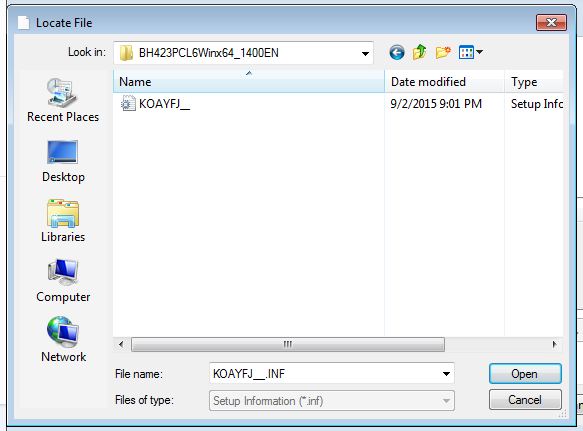
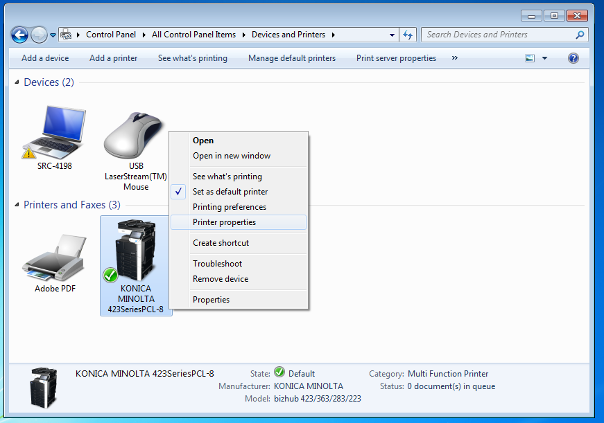
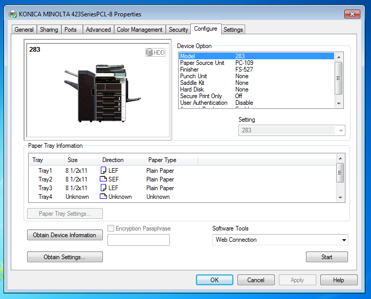
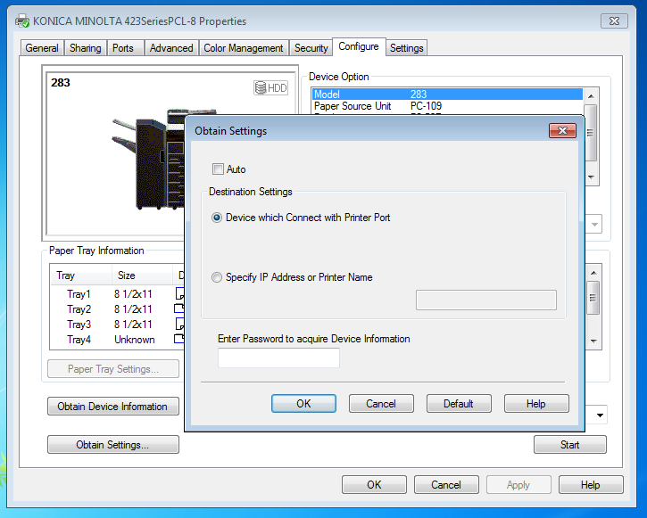
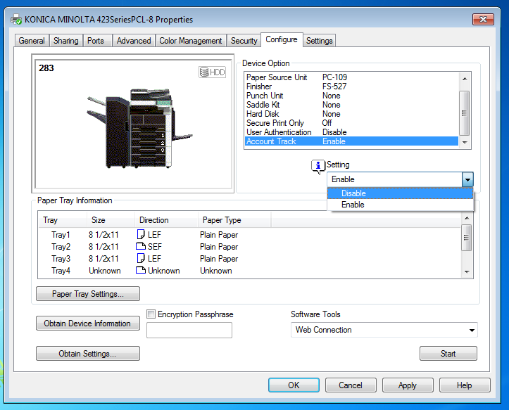

## Configuing Konica Minolta Printers

This article applies specifically to Windows computers.

### Connecting to the Konica Minolta Bizhubs When Adding a Printer

The drivers for our Konica Minolta BizHubs will not be automatically detected by the Windows Add Printer Wizard.  To connect to them, you'll first need to download the correct drivers from the Konica Minolta website.

For the Konica Minolta in Blodget, for example, search the Konica Minolta website for 'bizhub 423' and then download the 'PLC' driver files:

Once you have the drivers downloaded, extract their container .ZIP file somewhere on your computer wher you can find it. [**Note:** It's fine to extract in your downloads folder, and then delete the .ZIP file AND the extracted folder after configuration completes.  During the driver installation, Windows will automatically copy all needed information into the appropriate program directory.]

After you have the files downloaded and extracted, return to the Add Printer Wizard, tell it that you have the drivers on disk, navigate to them and then select them

After clicking 'OK', your printer should appear as having a digitally-signed driver. If so, click 'Next'.

### Configuring Konica Minolta Bizhubs After Installation

There are post-connection configuration steps necessary to allow printing to our Konica Minolta BizHubs.

Begin by opening 'Printer Properties' dialog array, which can be accessed by right-clicking the installed printer icon [shown in Control Panel > Devices and Printers].

Click on the 'Configure tab' in the Properties dialog array, then click 'Obtain Settings'.

In the pop-up 'Obtain Settings' box, uncheck the box where it says 'Auto' and click 'OK'.

With the auto-setting configuration disabled, you will now me able to manually set device options. To enable printing to the BizHubs, you'll need to disable the setting for 'Account Track', as shown:

And that's it!
